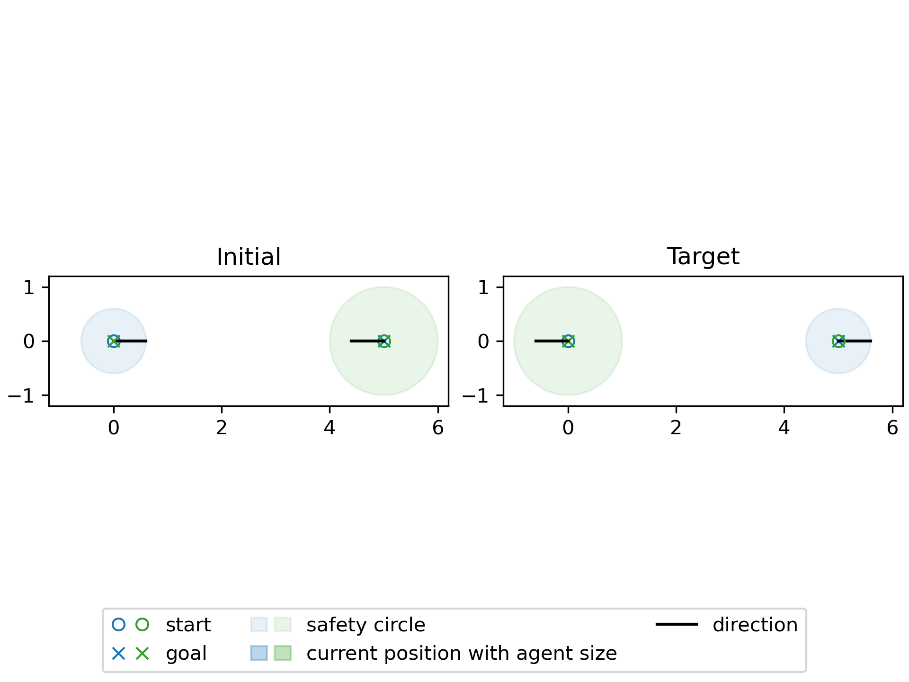
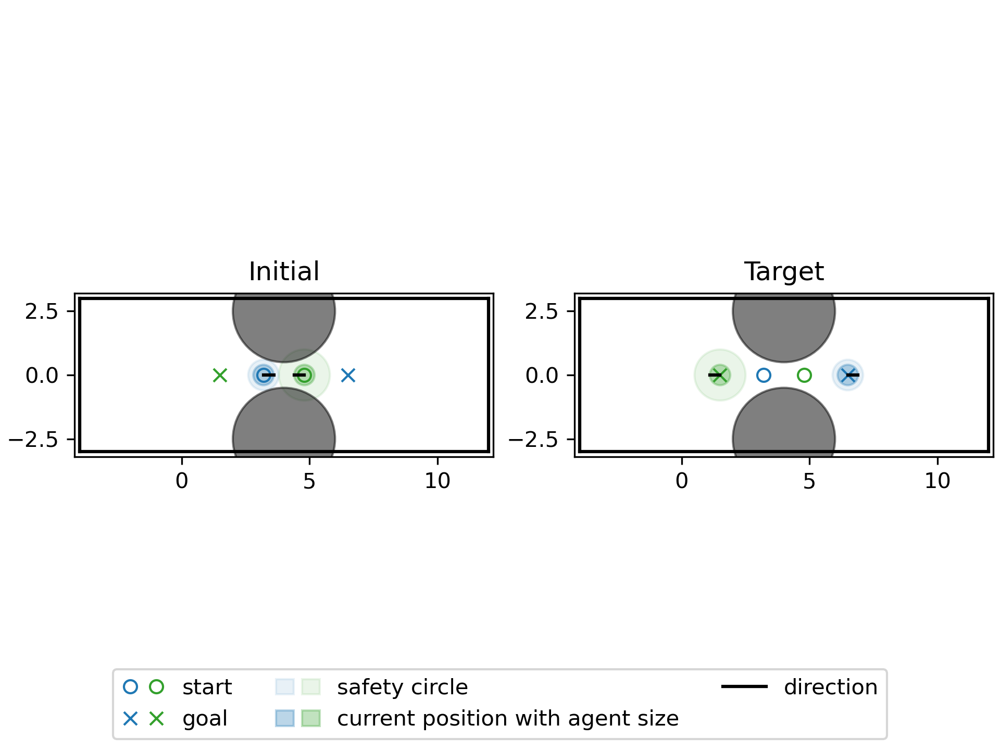
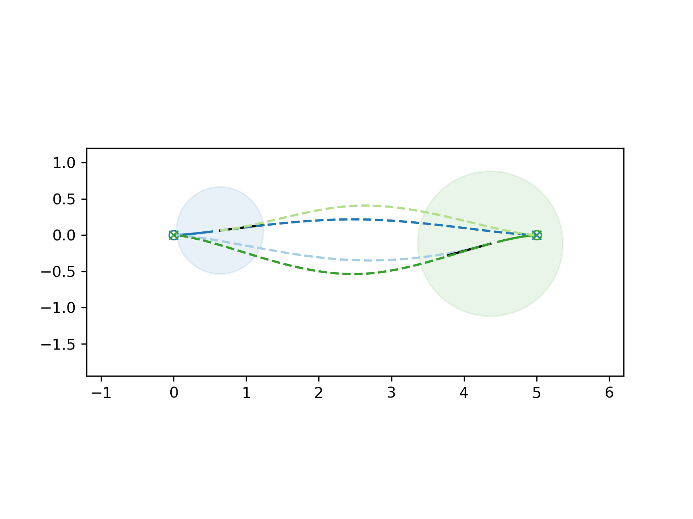
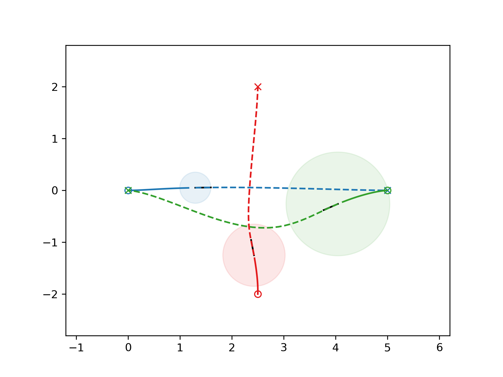
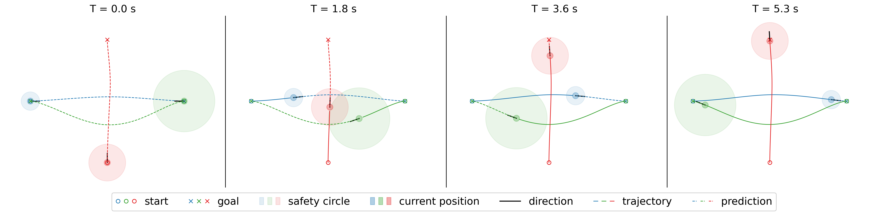
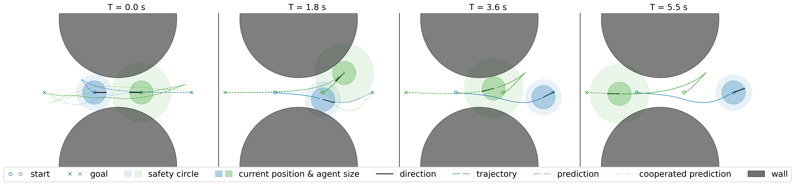
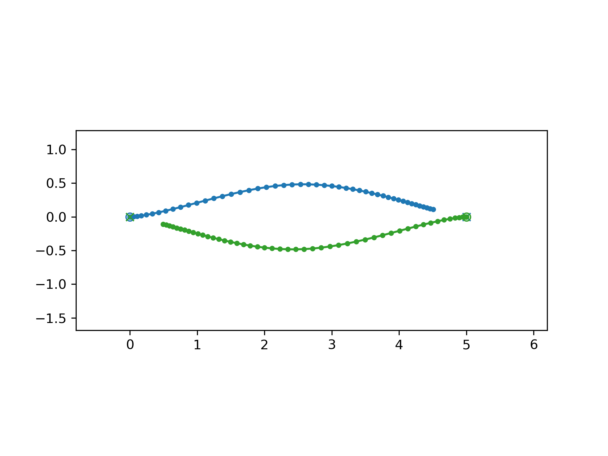
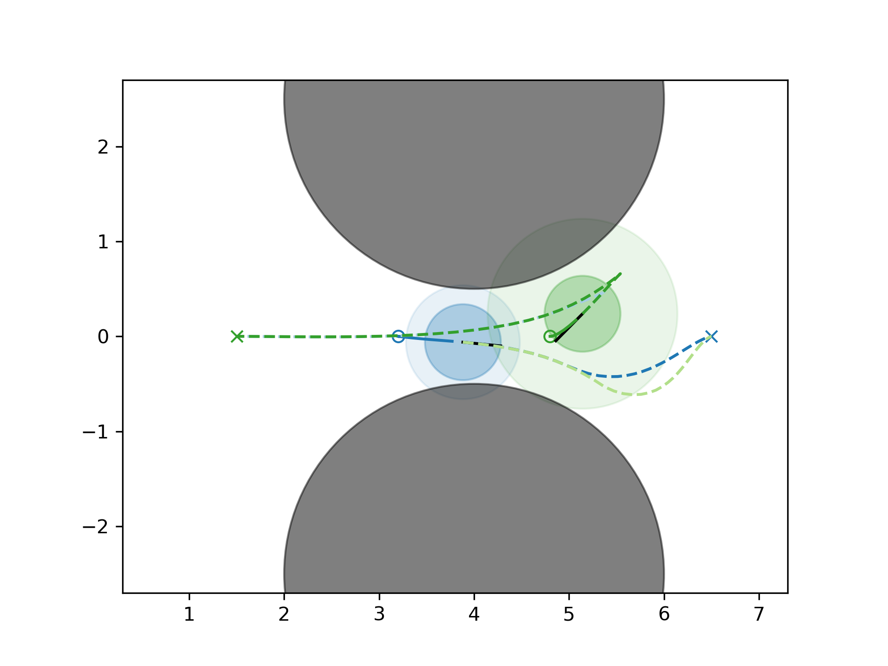

# Distributed Multi-agent Interaction Generation with Imagined Potential Games

## Table of Contents
- [Introduction](#introduction)
- [Installation](#installation)
- [How to use?](#how-to-use)

## Introduction
This is a simulator for distributed multi-agents navigation problem, generating the optimized trajectory with imagined potential games and iLQR solver.

Paper : [Distributed Multi-agent Interaction Generation with Imagined Potential Games](https://arxiv.org/pdf/2310.01614v1.pdf)

Demo Website: https://sites.google.com/berkeley.edu/distributed-interaction

## Installation

- Create conda environment: `conda create -n trajopt python=3.8 pip`
- Activate conda environment: `conda activate trajopt`
- Install [Trajax](https://github.com/google/trajax): `pip install git+https://github.com/google/trajax`
- Install dependencies: `conda install numpy jax seaborn matplotlib`
- Install other dependencies: `pip install moviepy scikit-learn`
- Test installation via running the example: `python test.py`

**note : JAX version = 0.3.14

## How to use?
### Create a Custom Demo

#### Step 1 : Set up Agents and Obstacles in 'simulation.py'

- Create Agents
  ```
  def agent_setting(self):
  
      # Set any number of agents you want.
      agent_1 = SingleAgent(
            initial_state=np.array([0.0, 0.0, 0.0, 0.0]),
            target_state=np.array([5.0, 0, 0, 0]),
            Q=np.array([0.01, 0.01, 0, 0]),
            R=np.array([1, 1]),
            Dis_weight=100,
            Back_weight=10,
            safety_dis=1.2)
      agent_2 = SingleAgent(
            initial_state=np.array([5, 0.00, np.pi, 0]),
            target_state=np.array([0, 0.0, np.pi, 0]),
            Q=np.array([0.01, 0.01, 0, 0]),
            R=np.array([1, 1]),
            Dis_weight=100,
            Back_weight=10,
            safety_dis=2.0)
      
      # If you want to change the size of the agent
      for agent in agent_list:
          agent.radius = 0
      
      # Build an agent list
      agent_list = [agent_1, agent_2]

      return agent_list
  ```
  
- Create Obstacles
  ```
  def obstacle_setting(self, circle_obstacle_num):
      circle_obs = CirObstacles(
            obstacle_num=circle_obstacle_num,
            pos=[np.array([4.0, 2.5]), 
                 np.array([4.0, -2.5])],
            radius=[2, 
                    2])

      return circle_obs
  ```
#### Step 2 : Create the Demo Function
- Open Case : boundary can be None
- Obstacle Case : need to set up boundary
- The 'simulation_type' can use any function in 'closed_loop_control.py' whose name starts with 'sim_'.

```
  def demo(self):
      # boundary = None
      boundary = onp.array([-4, -3, 12, 3])
          
      # Set up agents
      agent_list = self.agent_setting()
      agent_num = 2
      agents = MultiAgents(agent_list, agent_num)
      
      # Set up obstacles
      circle_obs = self.obstacle_setting1(circle_obstacle_num=2)
      
      # Combine the cost function weights of the agents to be used in solving
      cost_args = self.create_cost_args(agents)
          
      # closed-loop control simulation
      simulation_type(agents, cost_args, sim_time=4, sim_num=SIMULATION_NUMBER)
```

### Generate a Random Demo

#### Open case

Generate random setting 
```
sim.demo_random_open_case()
```
If you want to solve the same random setting with a different solver.
```
sim.demo_resolve_random_open_case(folder_name)
```

#### Obstacle case

Need to first set up boundary and circle obstacles
```
boundary = onp.array([-2, -3, 10, 3])
circle_obs = sim.obstacle_setting1(circle_obstacle_num=2)
```
Generate random setting 
```
sim.demo_random_obstacle_case(boundary, circle_obs)
```
If you want to solve the same random setting with a different solver.
```
sim.demo_resolve_random_obstacle_case(folder_name)
```

### What information will be saved?

#### 1 - Scenario Setting
> path = /ilqr_trajectory_optimization_planning/figs/[simulation folder name]/info.npz
> 
> path = /ilqr_trajectory_optimization_planning/figs/[simulation folder name]/info.txt

#### 2 - Open-loop planning of each agent at each time step
>path = /ilqr_trajectory_optimization_planning/figs/[simulation folder name]/agent_[order]_traj[time_step].txt

### Check solutions while simulation is running

#### 1 - Scenario Setting
The scenario setting image will be saved as 'environment.png' in the folder at the start.
>path = /ilqr_trajectory_optimization_planning/figs/[simulation folder name]/environment.png




#### 2 - Open-loop planning at each time step
At each time step, after generating the open-loop plan, the plan will be drawn and saved as 'img_XX.png' in the folder.
>path = /ilqr_trajectory_optimization_planning/figs/[simulation folder name]/img_[time_step].png

The prediction of others' trajectories will be drawn when there are only 2 agents.

<table>
    <thead>
        <tr>
            <th align="center"> Agent number = 2 </th>
            <th align="center"> Agent number >= 3 </th>
        </tr>
    </thead>
    <tbody>
        <tr>
            <td align="center">
              
            </td>
            <td align="center">
              
            </td>
        </tr>
    </tbody>
</table>

### Results after Simulation

#### 1 - gif & mp4 of the simulation

>path = /ilqr_trajectory_optimization_planning/figs/[simulation folder name]/demo.gif

>path = /ilqr_trajectory_optimization_planning/figs/[simulation folder name]/demo.mp4

#### 2 - closed-loop simulation process

>path = /ilqr_trajectory_optimization_planning/figs/[simulation folder name]/closedLoop.png




#### 3 - closed-loop trajectory image

>path = /ilqr_trajectory_optimization_planning/figs/[simulation folder name]/full_path.png

<p align="center">
  
</p>

#### 4 - open-loop trajectory image at each time step with same frame size

>path = /ilqr_trajectory_optimization_planning/figs/[simulation folder name]/img_[time_step].png
<p align="center">
  
</p>
The open-loop trajectory images generate during the simulation may not have same x-y range, therefore, these pictures will be regenerated after the whole simulation finish with same x-y range.

### Use "draw.py" to draw Results / Prediction

#### Draw Results
Enter the address of the folder that you want to regenerate the results.
```
folder_name = "[folder_address]/"
```
Then run "draw.py". It will create a folder called 'rebuild' and generate results inside.

#### Draw Prediction
**What is this?**

Create an open-loop solution video at a specific time step, which includes the predicted behavior of others, so that you can check the performance.

**How to assign the specific time step that you want to check the open-loop solution?**

Find below code in "draw.py", change the 'total_num' to the time step that you want to generate the open-loop solution video with prediction.
```
#############################
# Draw prediction video at certain time step
#############################
time_step = total_num
if time_step < total_num:
    draw_fxn.save_prediction_animation(agents, plot_boundary, save_name, time_step, boundary, circle_obs)
```
Notice: You can only enter the time step that you have already simulated.
